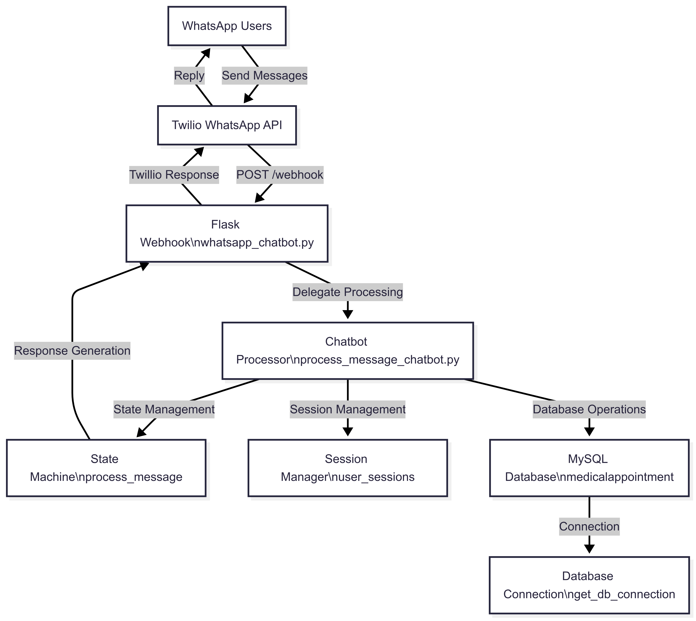

# 🏥 System Architecture for WhatsApp Medical Appointment Chatbot

This document provides a comprehensive overview of the high-level architecture for the **WhatsApp Medical Appointment Chatbot** system.  
It details the integration of the **Flask webhook**, **state machine chatbot**, and **MySQL database** to enable conversational appointment booking via WhatsApp.

---

## 📑 Table of Contents
- [Relevant Source Files](#relevant-source-files)
- [Technology Stack](#technology-stack)
- [System Components Overview](#system-components-overview)
- [Architecture Diagram](#architecture-diagram)

---

## Relevant Source Files

- `whatsapp_chatbot.py`
- `process_message_chatbot.py`
- `medicalappointment.sql`
- `requirements.txt`

---

## Technology Stack

| Component        | Technology            | Version | Purpose                   |
|------------------|----------------------|:------:|---------------------------|
| Web Framework    | Flask                | 3.1.1  | Webhook endpoint          |
| Database         | MySQL                | 8.4.4  | Data persistence         |
| External APIs    | Twilio               | 9.6.3  | WhatsApp integration     |
| Config           | python-dotenv        | 1.1.1  | Environment variables    |

**Note**:

This table shows the principal technologies.

To run the system, you must install all required Python packages listed in `requirements.txt`.

---

## System Components Overview

The system follows a **three-tier architecture**:

| Layer                | Component & File                                       | Purpose                                              |
|---------------------|--------------------------------------------------------|-----------------------------------------------------|
| Application Layer   | Flask webhook (`whatsapp_chatbot.py`)                  | Handles HTTP POST from Twilio's WhatsApp API        |
| Business Logic      | Chatbot processor (`process_message_chatbot.py`)       | Manages state machine & DB operations               |
| Data Layer          | MySQL database (`medicalappointment.sql`)              | Stores users, doctors & appointments data           |

---

## Architecture Diagram

